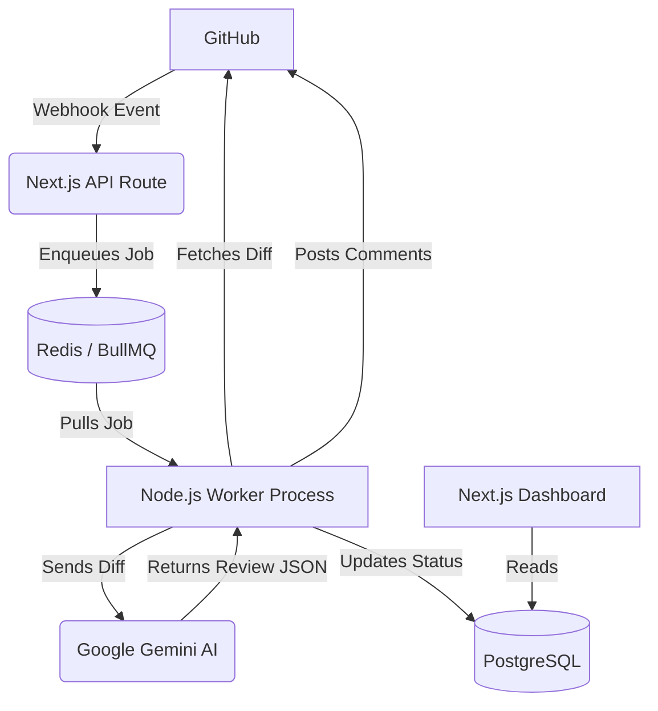

# IntelliPR Documentation

This document provides a deeper dive into the architecture, database schema, and setup requirements for the IntelliPR application.

## 🏗️ Architecture Overview

The system is designed to be highly scalable and robust against dropped webhooks by utilizing a background queueing system.

### 1. Webhook Reception
GitHub sends a `POST` request to `/api/webhooks`. The API verifies the cryptographic signature (`x-hub-signature-256`) using the `GITHUB_WEBHOOK_SECRET` to ensure the payload is genuinely from GitHub.

### 2. Job Queue (BullMQ)
If the webhook is for a valid `pull_request` event (opened, reopened, synchronized), the API creates a record in the database with a `pending` status and pushes a job to a Redis queue. This ensures that if the AI takes 30 seconds to review a PR, the Next.js server doesn't time out, and GitHub doesn't mark the webhook as failed.

### 3. Background Worker
A separate Node.js process (`src/workers/reviewWorker.ts`) listens to the Redis queue. When a job arrives, it uses the GitHub App's private key to generate a temporary installation token, fetches the PR diff, and sends it to the Gemini 2.5 Flash model with a strict system prompt.

### 4. Code Review & Database Sync
The worker parses the JSON response from Gemini, posts the review to the GitHub PR using the Octokit REST API, and updates the PR status in the PostgreSQL database to `reviewed`. It also saves the review statistics (summary, issue count) into the `Review` table for dashboard analytics.

## 🗄️ Database Schema (Prisma)

The application uses PostgreSQL with the following core entities:

- **User**: Managed by Clerk. We store the user's ID to link them to their repositories.
- **Repository**: Stores the GitHub repository ID, full name, and the `installationId` (required for auto-syncing webhooks).
- **PullRequest**: Tracks the status of each PR (`pending`, `reviewed`, `failed`).
- **Review**: Stores the exact output of the AI review (summary, issues found, token cost) for display on the dashboard.

## ⚙️ GitHub App Configuration

To replicate this environment, your GitHub App must be configured with the following settings:

### URLs
- **Homepage URL**: `http://localhost:3000`
- **Callback URL**: `http://localhost:3000/api/github/setup`
- **Setup URL**: `http://localhost:3000/api/github/setup`
- **Webhook URL**: `https://your-ngrok-url.ngrok-free.dev/api/webhooks`

> **Note**: *Redirect on update* MUST be checked under the Setup URL so users are redirected when adding new repositories. *Request user authorization (OAuth)* MUST be unchecked.

### Permissions
The app requires the following Repository Permissions:
- **Contents**: Read-only (To fetch the PR diff)
- **Pull Requests**: Read & Write (To post review comments)
- **Commit Statuses**: Read & Write

### Event Subscriptions
The app must be subscribed to the following webhook events:
- **Pull Request** (Triggers the AI review)
- **Repository** (Triggers auto-syncing when a user adds/removes repo access)

## 🧠 AI Prompting Strategy
The system prompt for Gemini is located in `src/lib/ai/gemini.ts`. It enforces a strict JSON schema output and instructs the model to act as a Senior Software Engineer. The temperature is set low (`0.2`) to ensure deterministic and highly factual code reviews rather than creative hallucinations.
